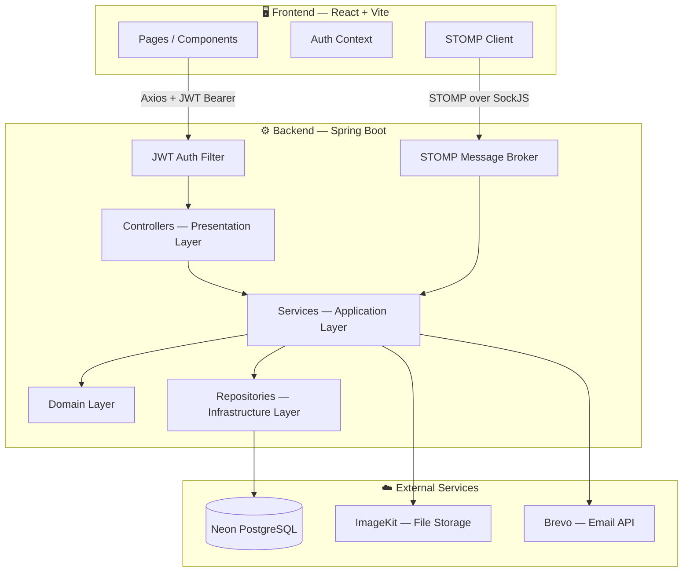
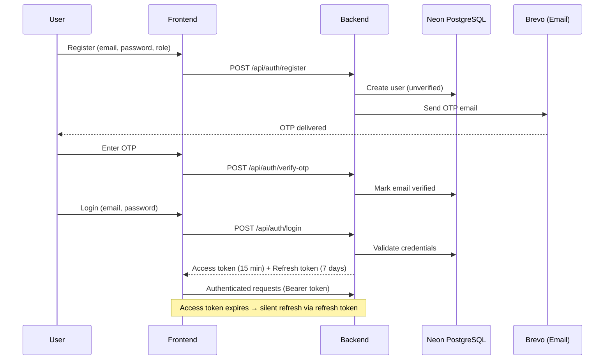
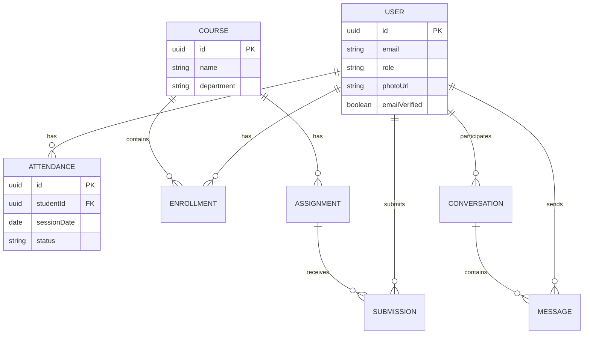

<div align="center">


<br/>

**A full-stack, production-deployed College ERP** — attendance, examinations, fees, library, real-time chat, and more, built with a modular Clean-Architecture-style Spring Boot backend and a modern React frontend.

<br/>

[](https://openjdk.org/)
[](https://spring.io/projects/spring-boot)
[](https://react.dev/)
[](https://neon.tech/)
[](https://tailwindcss.com/)

[](https://jwt.io/)
[](https://spring.io/guides/gs/messaging-stomp-websocket/)
[]()
[](LICENSE)


<br/>

**[🌐 Live Frontend](https://smart-campus-erp-beta.vercel.app)** &nbsp;·&nbsp;
**[⚙️ Live API](https://smart-campus-erp-8z3g.onrender.com)** &nbsp;·&nbsp;
**[📖 Documentation](#-documentation)** &nbsp;·&nbsp;
**[🐛 Report a Bug](../../issues/new?template=bug_report.md)**

</div>

<br/>

## 📋 Table of Contents

- [About](#-about)
- [Features](#-features)
- [Tech Stack](#-tech-stack)
- [Architecture](#-architecture)
- [Screenshots](#-screenshots)
- [Getting Started](#-getting-started)
- [Environment Configuration](#-environment-configuration)
- [Folder Structure](#-folder-structure)
- [Authentication Flow](#-authentication-flow)
- [API Documentation](#-api-documentation)
- [Deployment](#-deployment)
- [Roadmap](#-roadmap)
- [Contributing](#-contributing)
- [FAQ](#-faq)
- [Known Issues](#-known-issues)
- [License](#-license)
- [Author](#-author)

<br/>

## 📖 About

**Smart Campus ERP** is a full-stack Enterprise Resource Planning system built for colleges and universities — covering the entire academic lifecycle from attendance and examinations to fee collection and campus communication, for three role types: **Admin**, **Faculty**, and **Student**.

It's built the way a production application should be: a layered, modular backend (not one giant `controller`/`service` package), stateless JWT auth, a real-time WebSocket layer for chat and notifications, and a deployment pipeline across Vercel, Render, Neon, and ImageKit.

<br/>

## ✨ Features

<table>
<tr>
<td valign="top" width="33%">

**🔐 Core**
- JWT Authentication (access + refresh)
- Role-Based Access Control
- Email OTP Verification
- Profile Management

</td>
<td valign="top" width="33%">

**🎓 Academics**
- Attendance + QR Attendance
- Timetable Management
- Examinations & Marks
- Academic Calendar
- Coursework & Assignments

</td>
<td valign="top" width="34%">

**🏫 Campus Life**
- Real-time Chat (STOMP/WebSocket)
- Notice Board & Notifications
- Library Management
- Fee Management
- Leave & Grievance Portal
- Document Center & Reports

</td>
</tr>
</table>

<br/>

## 🛠 Tech Stack

<table>
<tr><td><b>Frontend</b></td><td>React 19 · Vite · Tailwind CSS 4 · React Router 7 · Axios · Framer Motion · Recharts</td></tr>
<tr><td><b>Backend</b></td><td>Java 21 · Spring Boot 3.5 · Spring Security · Spring Data JPA · Hibernate</td></tr>
<tr><td><b>Realtime</b></td><td>WebSocket (STOMP + SockJS)</td></tr>
<tr><td><b>Database</b></td><td>PostgreSQL (Neon serverless)</td></tr>
<tr><td><b>File Storage</b></td><td>ImageKit</td></tr>
<tr><td><b>Email</b></td><td>Brevo Transactional Email API</td></tr>
<tr><td><b>Deployment</b></td><td>Vercel (frontend) · Render (backend, Docker) </td></tr>
</table>

<br/>

## 🏗 Architecture

The backend follows a **package-by-feature, layered architecture** — each module (`auth`, `attendance`, `exam`, `fee`, `chat`, …) has its own `domain`, `application`, `infrastructure`, and `presentation` layers, rather than one global `controller`/`service`/`repository` split.



### Authentication & JWT Flow



### Database (Core Entities)



<br/>

## 📸 Screenshots

<div align="center">
<i>Add screenshots/GIFs of the Dashboard, Attendance, Chat, and Fee modules here once captured — drop image files into a <code>/docs/screenshots</code> folder and reference them below.</i>

```md


```
</div>

<br/>

## 🚀 Getting Started

### Prerequisites
- Java 21+, Maven
- Node.js 18+
- A PostgreSQL database (local or [Neon](https://neon.tech))

### Backend
```bash
cd backend
cp .env.example .env        # fill in your local values
./mvnw spring-boot:run
```

### Frontend
```bash
cd frontend
cp .env.example .env
npm install
npm run dev
```

Frontend runs on `http://localhost:5173`, backend on `http://localhost:8080`.

<br/>

## ⚙️ Environment Configuration

See [`backend/.env.example`](backend/.env.example) and [`frontend/.env.example`](frontend/.env.example) for the full list of required variables (database, JWT secret, Brevo API key, ImageKit key, CORS origins, etc.).

<br/>

## 📁 Folder Structure

```
smart-campus-erp/
├── backend/
│   ├── src/main/java/com/smartcampus/erp/
│   │   ├── application/<module>/{service, dto}
│   │   ├── domain/<module>/
│   │   ├── infrastructure/{persistence, security, storage}
│   │   ├── presentation/<module>/          # REST controllers
│   │   └── config/                         # Security, WebSocket, CORS
│   ├── Dockerfile
│   └── pom.xml
├── frontend/
│   ├── src/
│   │   ├── pages/{admin, faculty, student, shared, auth}
│   │   ├── components/  hooks/  context/  layouts/
│   │   ├── services/                       # API clients
│   │   └── routes/
│   └── vite.config.js
└── .github/                                # CI, issue & PR templates
```

<br/>

## 🔑 Authentication Flow

1. **Register** → account created, unverified
2. **Email OTP** (via Brevo API) → verify ownership
3. **Login** → short-lived access token (15 min) + refresh token (7 days)
4. **Every request** → `Authorization: Bearer <token>` validated by a `JwtAuthenticationFilter`
5. **WebSocket** → JWT validated on the STOMP `CONNECT` frame via a dedicated channel interceptor

<br/>

## 📚 API Documentation

Interactive Swagger UI is available once the backend is running:
```
{backend-url}/swagger-ui/index.html
```
Health check: `{backend-url}/actuator/health`

<br/>

## ☁️ Deployment

| Layer | Provider | Notes |
|---|---|---|
| Frontend | [Vercel](https://vercel.com) | Auto-deploys from `main`, root dir `frontend/` |
| Backend | [Render](https://render.com) | Dockerized, root dir `backend/` |
| Database | [Neon](https://neon.tech) | Serverless PostgreSQL |
| File Storage | [ImageKit](https://imagekit.io) | Profile photos, assignments, submissions |
| Email | [Brevo](https://brevo.com) | Transactional OTP emails (HTTP API — SMTP is blocked on most free PaaS tiers) |

<br/>

## 🗺 Roadmap

- [ ] Automated test suite (unit + integration)
- [ ] Flyway-based schema migrations
- [ ] API versioning (`/api/v1`)
- [ ] Push notifications
- [ ] Multi-instance WebSocket broker (Redis-backed) for horizontal scaling

<br/>

## 🤝 Contributing

Contributions are welcome! Please read [CONTRIBUTING.md](CONTRIBUTING.md) for guidelines, and note our [CODE_OF_CONDUCT.md](CODE_OF_CONDUCT.md).

<br/>

## ❓ FAQ

<details>
<summary><b>Why does the backend take ~10-15s to respond on first request?</b></summary>
<br/>
The backend is hosted on Render's free tier, which spins down after 15 minutes of inactivity. The first request after idle time triggers a cold start.
</details>

<details>
<summary><b>Why Brevo instead of Gmail SMTP for OTP emails?</b></summary>
<br/>
Most free-tier cloud hosts (including Render) block outbound SMTP ports (25/465/587) to prevent spam abuse. Brevo's HTTP API runs over standard HTTPS and isn't affected.
</details>

<br/>

## 🐞 Known Issues

- No automated test coverage yet (tracked in [Roadmap](#-roadmap))
- Free-tier hosting means occasional cold-start latency on the backend

<br/>

## 📄 License

Distributed under the MIT License. See [`LICENSE`](LICENSE) for details.

<br/>

## 👤 Author

**Balram Jat**

[](https://github.com/balramj681-cel)

<br/>

<div align="center">

⭐ If you found this project useful, consider giving it a star!

</div>